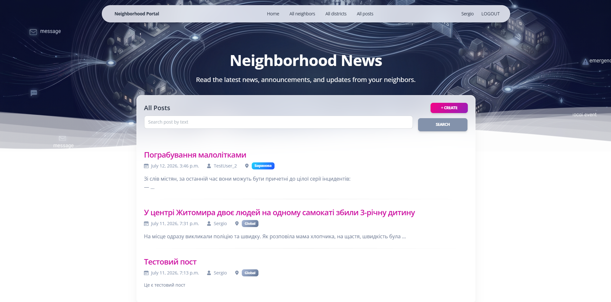
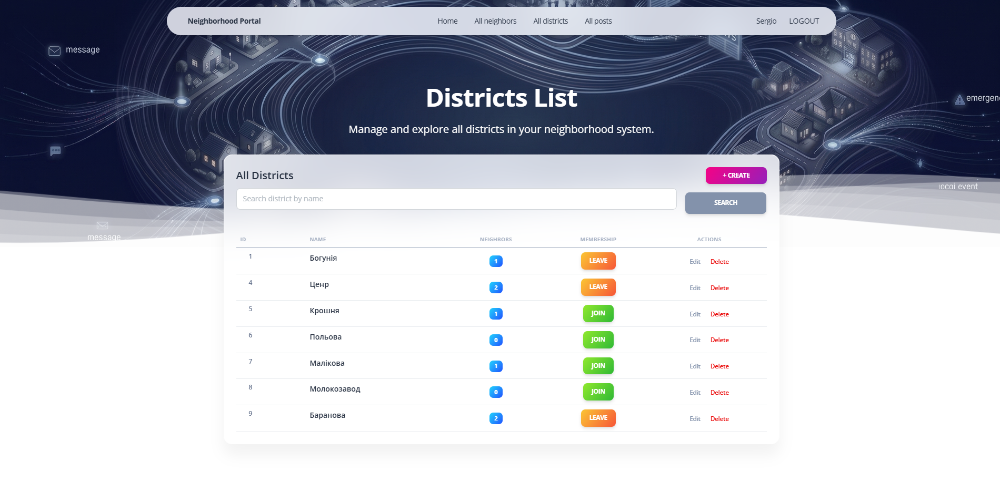
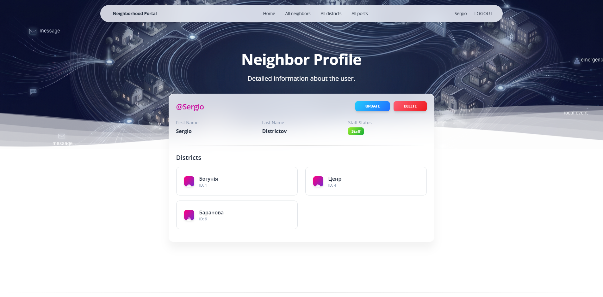
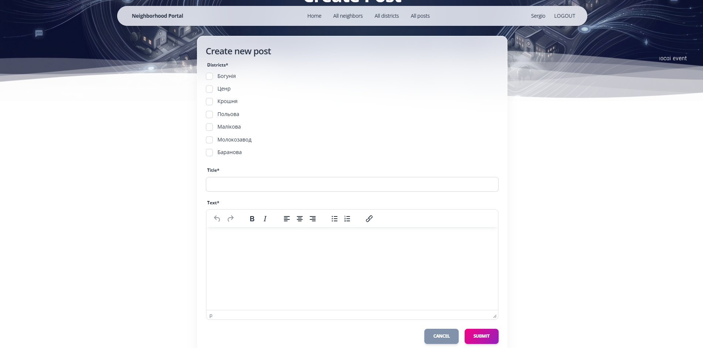

# my_neighborhood
# Neighborhood News System

## Overview
Neighborhood News System (also known as Neighborhood Portal) is a Django-based web application designed to help local residents connect, share announcements, and manage community districts. The platform provides a centralized news feed, district membership management, and a directory of neighbors.

## Features
* **User Authentication:** Secure login, registration, and session management.
* **Neighborhood Feed:** Create, read, update, and delete (CRUD) posts with a rich text editor (TinyMCE).
* **District Management:** Create local districts and easily toggle membership (Join/Leave).
* **Neighbor Directory:** View a searchable list of all registered neighbors and their associated districts.
* **Responsive UI:** Modern, glassmorphism-inspired design built with the Soft UI Design System (Bootstrap 5).

## Technologies Used
* **Backend:** Python 3, Django
* **Frontend:** HTML5, CSS3, Bootstrap 5 (Soft UI Design System)
* **Database:** SQLite (default)
* **Integrations:** TinyMCE (Rich Text Editor)

## Deployed Project
https://neighborhood-ngnq.onrender.com/
## Test User
- Login: user
- Password: user12345


## Setup Instructions

Follow these steps to get the project running on your local machine.

### 1. Clone the repository
```bash
git clone https://github.com/Sergio-zt/my_neighborhood.git
cd my_neighborhood
```

2. Create and activate a virtual environment
```bash
python -m venv venv
.\venv\Scripts\activate
```

### 3. Install dependencies
```bash
pip install -r requirements.txt
```

### 4. Apply database migrations
```bash
python manage.py migrate
```

### 5. Create a superuser (Optional)
```bash
python manage.py createsuperuser
```

### 6. Run the development server
```bash
python manage.py runserver
```

### DB structure diagram


### 1. Main Dashboard / Post Feed


### 2. Districts Management


### 3. Neighbor Profile


### 4. Create/Edit Post
